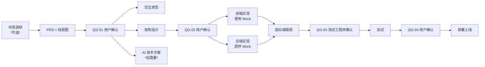

# [项目名称] 文档索引

> **注意**: 首次使用时，Claude Code 会自动检测并更新此文件中的项目信息。

> 最后更新：YYYY-MM-DD
> 维护者：Agent Team

---

## 项目信息

| 项目     | 内容             |
| -------- | ---------------- |
| 项目名称 | [请修改此处]     |
| 项目描述 | [请补充项目描述] |
| 创建日期 | YYYY-MM-DD       |
| 当前版本 | v0.1             |

---

## 目录结构

```
.claude/
├── agents/               # Agent 角色定义
│   ├── market_researcher.md
│   ├── product_manager.md
│   ├── ui_ux_designer.md
│   ├── architect.md
│   ├── ai_engineer.md
│   ├── backend_engineer.md
│   ├── frontend_engineer.md
│   ├── testing_engineer.md
│   └── devops_engineer.md
├── templates/            # 文档模板
│   ├── market_research_template.md
│   ├── prd_template.md
│   ├── architecture_template.md
│   ├── api_contract_template.md
│   ├── test_report_template.md
│   ├── devops_template.md
│   ├── config_template.md
│   ├── quality_gate.md
│   ├── mock_data_spec.md
│   ├── integration_workflow.md
│   ├── data_migration_sop.md
│   └── ops_weekly_report_template.md
└── doc/                  # 项目文档（由 Agent 生成）
    ├── PROJECT_INDEX.md    # 文档索引（由各角色 Agent 更新）
    ├── 01_Product_Design/       # 产品定义和设计
    │   └── prototypes/          # UI/UX 交互原型
    ├── 02_Architecture/         # 技术架构设计
    ├── 03_API_Contract/         # 接口规范与契约
    ├── 04_Test_Reports/         # 测试报告
    └── 05_DevOps/               # 运维部署文档
```

---

## 质量卡点状态

| 卡点  | 阶段转换             | 状态      | 通过日期 | 检查者 |
| ----- | -------------------- | --------- | -------- | ------ |
| QG-01 | 产品需求 → 架构/原型 | ⏳ 待检查 | -        | -      |
| QG-02 | 架构设计 → 代码实现  | ⏳ 待检查 | -        | -      |
| QG-03 | 代码实现 → 测试      | ⏳ 待检查 | -        | -      |
| QG-04 | 测试 → 部署          | ⏳ 待检查 | -        | -      |

---

## 文档清单

### 01_Product_Design - 产品定义

| 文件名   | 描述                             | 作者          | 版本 | 日期 |
| -------- | -------------------------------- | ------------- | ---- | ---- |
| _待添加_ | 市场调研报告                     | @市场调研     |      |      |
| _待添加_ | PRD 产品需求文档（含页面线框图） | @产品经理     |      |      |
| _待添加_ | UI/UX 设计说明                   | @UI/UX 设计师 |      |      |
| _待添加_ | 交互原型 (HTML)                  | @UI/UX 设计师 |      |      |

### 02_Architecture - 技术架构

| 文件名   | 描述             | 作者       | 版本 | 日期 |
| -------- | ---------------- | ---------- | ---- | ---- |
| _待添加_ | 技术架构设计文档 | @架构师    |      |      |
| _待添加_ | AI 技术方案设计  | @AI 工程师 |      |      |

### 03_API_Contract - 接口规范

| 文件名   | 描述                           | 作者          | 版本 | 日期 |
| -------- | ------------------------------ | ------------- | ---- | ---- |
| _待添加_ | API 接口规范 (OpenAPI/Swagger) | @架构师/@后端 |      |      |

### 04_Test_Reports - 测试报告

| 文件名   | 描述         | 作者        | 版本 | 日期 |
| -------- | ------------ | ----------- | ---- | ---- |
| _待添加_ | 功能测试报告 | @测试工程师 |      |      |
| _待添加_ | 性能测试报告 | @测试工程师 |      |      |
| _待添加_ | E2E 测试报告 | @测试工程师 |      |      |

### 05_DevOps - 运维部署

| 文件名   | 描述             | 作者    | 版本 | 日期 |
| -------- | ---------------- | ------- | ---- | ---- |
| _待添加_ | CI/CD 流水线配置 | @DevOps |      |      |
| _待添加_ | 容器化部署配置   | @DevOps |      |      |
| _待添加_ | 监控告警配置     | @DevOps |      |      |
| _待添加_ | 运维巡检周报     | @DevOps |      |      |

---

## 协作流程



---

## 更新日志

| 日期       | 操作                              | 文件                              | 操作者     |
| ---------- | --------------------------------- | --------------------------------- | ---------- |
| 2026-03-01 | 创建索引                          | PROJECT_INDEX.md                  | Agent Team |
| 2026-03-01 | 新增 9 个文档模板                  | templates/\*                      | @用户      |

---

## 使用说明

### 如何更新此索引

1. 当任何 Agent 在 `.claude/doc/` 目录下创建新文档时，必须同步更新此索引
2. 更新对应表格，添加文件信息
3. 在更新日志中记录本次变更

### 文档命名规范

```
[角色前缀]_[功能描述]_[版本/日期].md

示例：
- prd_pawlog_v1.0.md
- arch_pawlog_system_v1.0.md
- api_user_module_v1.0.md
- test_report_login_20260301.md
```
