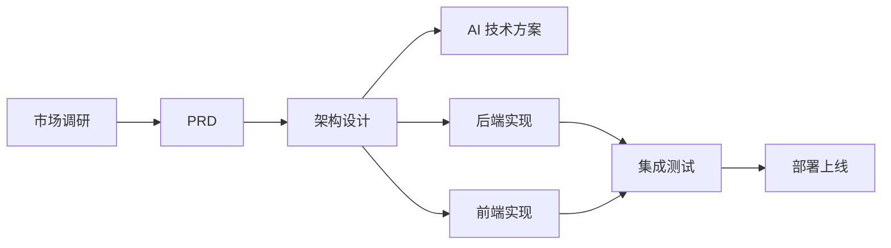

# 项目文档索引 - [项目名称]

> 最后更新：2026-03-01
> 维护者：Agent Team

---

## 目录结构

```
.claude/doc/
├── 01_Product_Design/      # 产品定义与设计
│   └── prototypes/         # UI/UX 交互原型
├── 02_Architecture/        # 技术架构设计
├── 03_API_Contract/        # 接口规范与契约
├── 04_Test_Reports/        # 测试报告
└── 05_DevOps/              # 运维部署文档
```

---

## 文档清单

### 01_Product_Design - 产品定义

| 文件名 | 描述 | 作者 | 版本 | 日期 |
|--------|------|------|------|------|
| _待添加_ | | | | |

### 02_Architecture - 技术架构

| 文件名 | 描述 | 作者 | 版本 | 日期 |
|--------|------|------|------|------|
| _待添加_ | | | | |

### 03_API_Contract - 接口规范

| 文件名 | 描述 | 作者 | 版本 | 日期 |
|--------|------|------|------|------|
| _待添加_ | | | | |

### 04_Test_Reports - 测试报告

| 文件名 | 描述 | 作者 | 版本 | 日期 |
|--------|------|------|------|------|
| _待添加_ | | | | |

### 05_DevOps - 运维部署

| 文件名 | 描述 | 作者 | 版本 | 日期 |
|--------|------|------|------|------|
| _待添加_ | | | | |

---

## 协作流程



---

## 更新日志

| 日期 | 操作 | 文件 | 操作者 |
|------|------|------|--------|
| 2026-03-01 | 创建索引 | PROJECT_INDEX.md | Agent Team |
