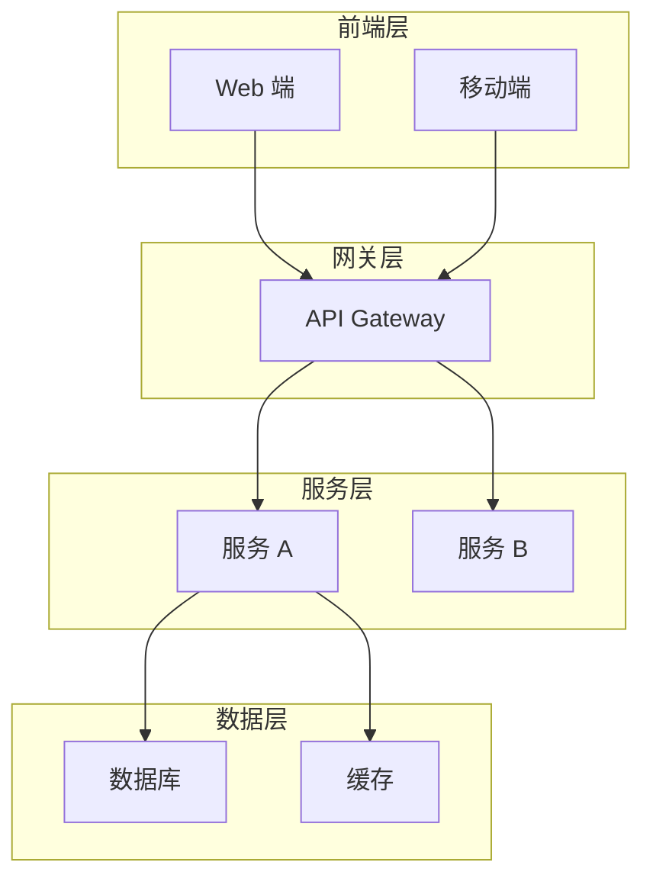
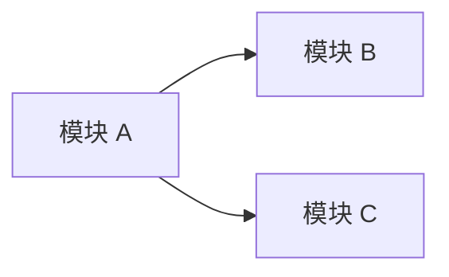

# 技术架构设计 - [项目名称]

> 版本：v1.0
> 日期：YYYY-MM-DD
> 作者：@架构师

---

## 1. 技术选型

> 💡 **填写说明**：技术选型需要说明"为什么选 A 不选 B"，考虑团队技能、项目规模、长期维护成本。

### 1.1 后端技术栈
> 💡 **示例**：
> | 组件 | 技术选择 | 理由 | Trade-off |
> |-----|---------|------|----------|
> | 框架 | Node.js + Express | 团队熟悉 JS 生态，开发效率高 | 性能不如 Go，但本项目 QPS 需求不高 |
> | 数据库 | PostgreSQL 15 | ACID 保证，JSON 支持好 | 写入性能略低于 MySQL，但功能更丰富 |
> | 缓存 | Redis 7 | 数据结构丰富，支持持久化 | 内存成本较高，用于热点数据 |

| 组件 | 技术选择 | 理由 | Trade-off |
|-----|---------|------|----------|
| 框架 | | | |
| 数据库 | | | |
| 缓存 | | | |
| 消息队列 | | | |

### 1.2 前端技术栈
> 💡 **示例**：
> | 组件 | 技术选择 | 理由 |
> |-----|---------|------|
> | 框架 | React 18 | 生态丰富，团队熟悉 |
> | 状态管理 | Zustand | 轻量级，API 简单 |
> | UI 库 | Ant Design | 组件丰富，企业级设计 |

| 组件 | 技术选择 | 理由 |
|-----|---------|------|
| 框架 | | |
| 状态管理 | | |
| UI 库 | | |

### 1.3 基础设施
> 💡 **示例**：
> | 组件 | 技术选择 | 说明 |
> |-----|---------|------|
> | 云服务 | AWS | 团队已有 AWS 经验 |
> | CDN | CloudFront | 与 S3 集成好 |
> | 监控 | DataDog | 全栈监控，告警完善 |

| 组件 | 技术选择 | 说明 |
|-----|---------|------|
| 云服务 | | |
| CDN | | |
| 监控 | | |

---

## 2. 系统架构

### 2.1 整体架构图

> 💡 **填写说明**：
> - 使用 Mermaid 绘制，确保可渲染
> - 标注数据流向和关键组件
> - 复杂系统可以分层次绘制（用户层、应用层、数据层）

### 2.2 数据流向
> 💡 **填写说明**：描述典型请求的完整处理链路，包括数据持久化流程。

1. [请求流程说明 - 示例：用户请求 → Load Balancer → API Gateway → 业务服务 → 数据库]
2. [数据持久化流程 - 示例：写入主库后，通过 Binlog 同步到从库和 ES]

---

## 3. 模块划分

### 3.1 服务边界
> 💡 **填写说明**：明确每个模块/服务的职责，避免职责交叉。

| 模块 | 职责 | 接口 |
|-----|------|-----|
| | | |

**示例行**：
| 用户服务 | 用户注册、登录、认证、个人信息管理 | REST /api/v1/users/* |
| 订单服务 | 订单创建、支付、退款、查询 | REST /api/v1/orders/* |

### 3.2 模块依赖关系

> 💡 **填写说明**：标注模块之间的依赖方向，避免循环依赖。

---

## 4. 非功能性设计

### 4.1 性能指标

> 💡 **填写说明**：指标应该是可衡量的，并且与 PRD 中的非功能需求保持一致。

| 指标 | 目标值 | 说明 |
|-----|-------|------|
| QPS | | 峰值每秒请求数 |
| 延迟 (P95) | | 95% 请求的响应时间 |
| 吞吐量 | | 单位时间处理请求数 |

### 4.2 可用性设计

> 💡 **示例**：
> - **SLA 目标**: 99.9%（每月宕机时间不超过 43.8 分钟）
> - **容灾策略**: 多可用区部署，单 AZ 故障自动切换
> - **备份策略**: 数据库每日全量备份 + Binlog 实时备份

- **SLA 目标**: [目标值]
- **容灾策略**: [描述]
- **备份策略**: [描述]

### 4.3 安全性设计

> 💡 **示例**：
> - **认证**: JWT + Refresh Token 双令牌机制
> - **授权**: RBAC 基于角色的访问控制
> - **加密**: TLS 1.3 传输加密，AES-256 静态数据加密

- **认证**: [方案]
- **授权**: [方案]
- **加密**: [方案]

---

## 5. API 设计规范

### 5.1 API 风格

> 💡 **填写说明**：选择主要的 API 风格，可以混合使用但需说明场景。

- [ ] RESTful - 资源导向，适合 CRUD 场景
- [ ] gRPC - 高性能 RPC，适合内部服务调用
- [ ] GraphQL - 灵活查询，适合 BFF 层

### 5.2 版本控制

> 💡 **示例**：
> - URL 路径版本：`/api/v1/resource`
> - Header 版本：`Accept: application/vnd.api.v1+json`

- URL 路径版本：`/api/v1/...`

### 5.3 错误码规范

> 💡 **填写说明**：错误码应该有清晰的分类，便于定位问题。

| 错误码 | 说明 | HTTP 状态码 |
|-------|------|-----------|
| 40000 | 参数错误 | 400 |
| 40100 | 未认证 | 401 |
| 40300 | 无权限 | 403 |
| 50000 | 服务器错误 | 500 |

---

## 6. 部署架构

### 6.1 环境规划
| 环境 | 用途 | 配置 |
|-----|------|-----|
| Dev | 开发 | |
| Staging | 预发布 | |
| Prod | 生产 | |

---

## 7. 技术债务与风险

| 风险点 | 影响 | 缓解措施 |
|-------|------|---------|
| | | |

---

## 8. 开发环境配置

### 8.1 必装中间件清单
| 中间件 | 版本 | 端口 | 用途 |
|-------|------|------|------|
| | | | |

### 8.2 配置文件
- 创建 `.env.development` 文件
- 创建 `docker-compose.yml` 启动中间件
- 配置详情参考：`config_[项目简称]_v1.0.md`

### 8.3 配置传递
- **@后端工程师**：读取 `config_[项目简称]_v1.0.md` 获取数据库/中间件配置
- **@DevOps**：读取 `config_[项目简称]_v1.0.md` 获取生产环境配置方案

---

## 9. 配置文档索引

| 文档名称 | 路径 | 用途 |
|---------|------|------|
| 环境配置规范 | `config_[项目简称]_v1.0.md` | 中间件配置、环境变量、Docker Compose |

---

**Path: `.claude/doc/02_Architecture/arch_[项目简称]_[文档类型]_v[版本号].md`**
