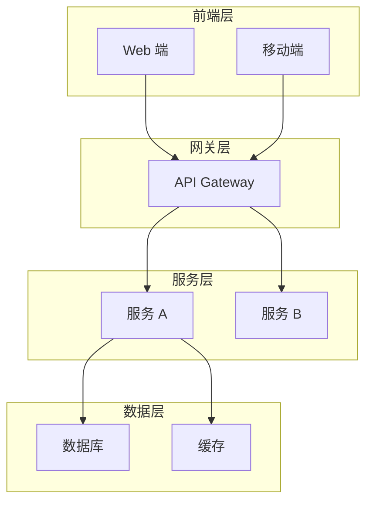
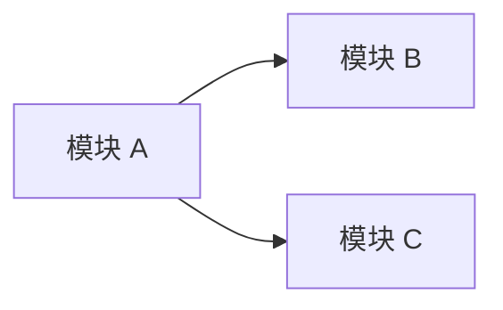

# 技术架构设计 - [项目名称]

> 版本：v1.0
> 日期：YYYY-MM-DD
> 作者：@架构师

---

## 1. 技术选型

### 1.1 后端技术栈
| 组件 | 技术选择 | 理由 | Trade-off |
|-----|---------|------|----------|
| 框架 | | | |
| 数据库 | | | |
| 缓存 | | | |
| 消息队列 | | | |

### 1.2 前端技术栈
| 组件 | 技术选择 | 理由 |
|-----|---------|------|
| 框架 | | |
| 状态管理 | | |
| UI 库 | | |

### 1.3 基础设施
| 组件 | 技术选择 | 说明 |
|-----|---------|------|
| 云服务 | | |
| CDN | | |
| 监控 | | |

---

## 2. 系统架构

### 2.1 整体架构图

### 2.2 数据流向
1. [请求流程说明]
2. [数据持久化流程]

---

## 3. 模块划分

### 3.1 服务边界
| 模块 | 职责 | 接口 |
|-----|------|-----|
| | | |

### 3.2 模块依赖关系

---

## 4. 非功能性设计

### 4.1 性能指标
| 指标 | 目标值 | 说明 |
|-----|-------|------|
| QPS | | |
| 延迟 (P95) | | |
| 吞吐量 | | |

### 4.2 可用性设计
- **SLA 目标**: 99.9%
- **容灾策略**: [描述]
- **备份策略**: [描述]

### 4.3 安全性设计
- **认证**: [方案]
- **授权**: [方案]
- **加密**: [方案]

---

## 5. API 设计规范

### 5.1 API 风格
- [ ] RESTful
- [ ] gRPC
- [ ] GraphQL

### 5.2 版本控制
- URL 路径版本：`/api/v1/...`

### 5.3 错误码规范
| 错误码 | 说明 | HTTP 状态码 |
|-------|------|-----------|
| 40000 | 参数错误 | 400 |
| 40100 | 未认证 | 401 |
| 40300 | 无权限 | 403 |
| 50000 | 服务器错误 | 500 |

---

## 6. 部署架构

### 6.1 环境规划
| 环境 | 用途 | 配置 |
|-----|------|-----|
| Dev | 开发 | |
| Staging | 预发布 | |
| Prod | 生产 | |

---

## 7. 技术债务与风险

| 风险点 | 影响 | 缓解措施 |
|-------|------|---------|
| | | |

---

**Path: `.claude/doc/02_Architecture/arch_[项目简称]_[文档类型]_v[版本号].md`**
