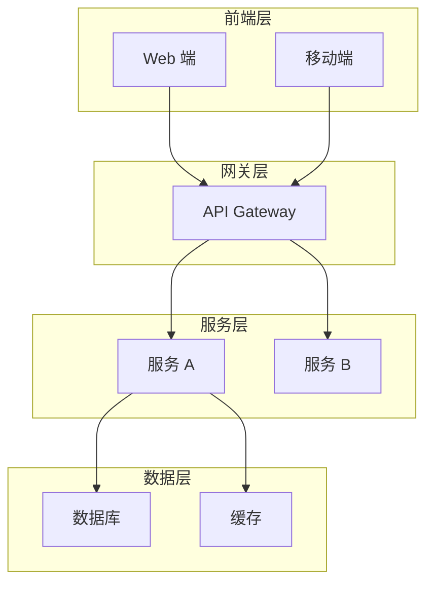
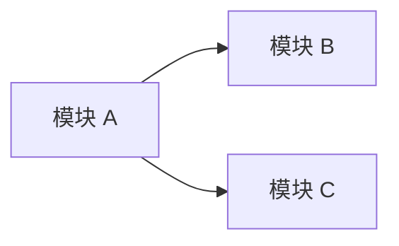

# 技术架构设计 - [项目名称]

> 版本：v1.0
> 日期：YYYY-MM-DD
> 作者：@架构师

---

## 1. 技术选型

> 💡 **填写说明**：技术选型需要说明"为什么选 A 不选 B"，考虑团队技能、项目规模、长期维护成本。
>
> **避免过度设计**：选择最合适的技术，而不是最先进的技术。小项目不需要微服务、消息队列等复杂架构。

### 1.1 后端技术栈

> 💡 **示例**：
> | 组件 | 技术选择 | 理由 | Trade-off |
> |-----|---------|------|----------|
> | 框架 | Node.js + Express | 团队熟悉 JS 生态，开发效率高 | 性能不如 Go，但本项目 QPS 需求不高 |
> | 数据库 | PostgreSQL 15 | ACID 保证，JSON 支持好 | 写入性能略低于 MySQL，但功能更丰富 |
> | 缓存 | Redis 7 | 数据结构丰富，支持持久化 | 内存成本较高，用于热点数据 |

| 组件     | 技术选择 | 理由 | Trade-off |
| -------- | -------- | ---- | --------- |
| 框架     |          |      |           |
| 数据库   |          |      |           |
| 缓存     |          |      |           |
| 消息队列 |          |      |           |

### 1.2 前端技术栈

> 💡 **示例**：
> | 组件 | 技术选择 | 理由 |
> |-----|---------|------|
> | 框架 | React 18 | 生态丰富，团队熟悉 |
> | 状态管理 | Zustand | 轻量级，API 简单 |
> | UI 库 | Ant Design | 组件丰富，企业级设计 |

| 组件     | 技术选择 | 理由 |
| -------- | -------- | ---- |
| 框架     |          |      |
| 状态管理 |          |      |
| UI 库    |          |      |

### 1.3 基础设施

> 💡 **示例**：
> | 组件 | 技术选择 | 说明 |
> |-----|---------|------|
> | 云服务 | AWS | 团队已有 AWS 经验 |
> | CDN | CloudFront | 与 S3 集成好 |
> | 监控 | DataDog | 全栈监控，告警完善 |

| 组件   | 技术选择 | 说明 |
| ------ | -------- | ---- |
| 云服务 |          |      |
| CDN    |          |      |
| 监控   |          |      |

---

## 2. 系统架构

### 2.1 整体架构图

> 💡 **填写说明**：
>
> - 使用 Mermaid 绘制，确保可渲染
> - 标注数据流向和关键组件
> - 复杂系统可以分层次绘制（用户层、应用层、数据层）

### 2.2 数据流向

> 💡 **填写说明**：描述典型请求的完整处理链路，包括数据持久化流程。

1. [请求流程说明 - 示例：用户请求 → Load Balancer → API Gateway → 业务服务 → 数据库]
2. [数据持久化流程 - 示例：写入主库后，通过 Binlog 同步到从库和 ES]

---

## 3. 模块划分

### 3.1 服务边界

> 💡 **填写说明**：明确每个模块/服务的职责，避免职责交叉。

| 模块 | 职责 | 接口 |
| ---- | ---- | ---- |
|      |      |      |

**示例行**：
| 用户服务 | 用户注册、登录、认证、个人信息管理 | REST /api/v1/users/_ |
| 订单服务 | 订单创建、支付、退款、查询 | REST /api/v1/orders/_ |

### 3.2 模块依赖关系

> 💡 **填写说明**：标注模块之间的依赖方向，避免循环依赖。

---

## 4. 数据架构设计

> 💡 **填写说明**：
>
> - 基于产品经理的业务数据模型，转化为技术数据模型
> - 明确每类数据的存储选型和访问模式
> - ⚠️ **架构师**负责数据架构设计（实体模型、存储映射、缓存策略），**后端工程师**负责数据库详细实现（精确字段类型、索引策略、迁移脚本）

### 4.1 核心实体模型

> 💡 **填写说明**：将业务数据模型转化为技术实体模型，定义实体的关键字段和关系类型。
>
> **示例**：
> | 实体 | 关键字段 | 关系 | 说明 |
> |------|---------|------|------|
> | User | id, email, name, role | 1:N → Order | 系统用户，支持 RBAC |
> | Order | id, user_id, total, status | N:1 → User, 1:N → OrderItem | 订单主表 |
> | Product | id, name, price, stock | 1:N → OrderItem | 商品信息 |

| 实体 | 关键字段 | 关系 | 说明 |
| ---- | -------- | ---- | ---- |
|      |          |      |      |

### 4.2 存储选型映射

> 💡 **填写说明**：明确每类数据用什么存储引擎，为什么选它。小项目可能只有一个数据库，直接说明即可。
>
> **示例**：
> | 数据类型 | 存储引擎 | 选型理由 |
> |---------|---------|---------|
> | 业务核心数据（User/Order） | PostgreSQL | ACID 保证，关系查询 |
> | 会话/缓存 | Redis | 高速读写，TTL 支持 |
> | 全文检索（可选） | Elasticsearch | 复杂搜索场景 |

| 数据类型 | 存储引擎 | 选型理由 |
| -------- | -------- | -------- |
|          |          |          |

### 4.3 数据访问模式

> 💡 **填写说明**：识别读密集/写密集实体，决定缓存和读写分离策略。小项目可简要说明。
>
> **示例**：
> | 实体 | 读写特征 | 缓存策略 | 备注 |
> |------|---------|---------|------|
> | Product | 读密集 | Redis 缓存，5min TTL | 商品列表高频访问 |
> | Order | 写密集 | 不缓存 | 需事务保证 |
> | User | 读密集 | Session 缓存 | 登录态频繁读取 |

| 实体 | 读写特征 | 缓存策略 | 备注 |
| ---- | -------- | -------- | ---- |
|      |          |          |      |

---

## 5. 非功能性设计

> 💡 **填写说明**：根据项目规模选择合适的设计深度，避免过度设计。
>
> **规模分级参考**：
> | 规模 | DAU | 非功能性设计重点 |
> |------|-----|-----------------|
> | 小项目 | < 1 万 | 基础安全、数据库备份 |
> | 中项目 | 1-10 万 | 性能指标、缓存策略、监控告警 |
> | 大项目 | > 10 万 | 完整性能指标、容灾策略、微服务架构 |

### 5.1 性能指标

> 💡 **按项目规模选择**：
>
> - **小项目**：可跳过 QPS、吞吐量等复杂指标，只关注核心接口响应时间
> - **中项目**：核心接口 P95 < 500ms，QPS < 1000
> - **大项目**：完整性能指标，QPS、延迟、吞吐量都需要定义

| 指标       | 目标值 | 说明                               |
| ---------- | ------ | ---------------------------------- |
| QPS        | [可选] | 峰值每秒请求数（小项目可跳过）     |
| 延迟 (P95) | [可选] | 95% 请求的响应时间                 |
| 吞吐量     | [可选] | 单位时间处理请求数（小项目可跳过） |

### 5.2 可用性设计

> 💡 **按项目规模选择**：
>
> - **小项目**：数据库每日备份即可
> - **中项目**：读写分离 + 监控告警
> - **大项目**：多可用区部署、容灾策略

- **SLA 目标**: [目标值，小项目可跳过]
- **容灾策略**: [描述，小项目可写"无"]
- **备份策略**: [描述]

### 5.3 安全性设计

> 💡 **基础安全**（所有项目必需）：
>
> - 认证：JWT 或 Session 认证
> - 授权：基于角色的访问控制
> - 加密：HTTPS 传输加密

- **认证**: [方案]
- **授权**: [方案，如 RBAC]
- **加密**: [方案，如 TLS 1.3]

---

## 6. API 设计规范

### 6.1 API 风格

> 💡 **填写说明**：选择主要的 API 风格，可以混合使用但需说明场景。

- [ ] RESTful - 资源导向，适合 CRUD 场景
- [ ] gRPC - 高性能 RPC，适合内部服务调用
- [ ] GraphQL - 灵活查询，适合 BFF 层

### 6.2 版本控制

> 💡 **示例**：
>
> - URL 路径版本：`/api/v1/resource`
> - Header 版本：`Accept: application/vnd.api.v1+json`

- URL 路径版本：`/api/v1/...`

### 6.3 错误码规范

> 💡 **填写说明**：错误码应该有清晰的分类，便于定位问题。

| 错误码 | 说明       | HTTP 状态码 |
| ------ | ---------- | ----------- |
| 40000  | 参数错误   | 400         |
| 40100  | 未认证     | 401         |
| 40300  | 无权限     | 403         |
| 50000  | 服务器错误 | 500         |

---

## 7. 部署架构

### 7.1 环境规划

> 💡 **按项目规模选择**：
>
> - **小项目**：开发/生产 两个环境即可
> - **中大型项目**：开发/预发布/生产 三个环境

| 环境    | 用途           | 配置   |
| ------- | -------------- | ------ |
| Dev     | 开发           | [配置] |
| Staging | 预发布（可选） | [配置] |
| Prod    | 生产           | [配置] |

---

## 8. 技术债务与风险

| 风险点 | 影响 | 缓解措施 |
| ------ | ---- | -------- |
|        |      |          |

---

## 9. 开发环境配置

### 9.1 必装中间件清单

> 💡 **按项目规模选择**：只列出必需的中间件，避免过度设计。

| 中间件 | 版本 | 端口 | 用途 |
| ------ | ---- | ---- | ---- |
|        |      |      |      |

### 9.2 配置文件

- 创建 `.env.development` 文件
- 创建 `docker-compose.yml` 启动中间件（可选，按团队习惯）
- 配置详情参考：`config_[项目简称]_v1.0.md`

### 9.3 配置传递

- **@后端工程师**：读取 `config_[项目简称]_v1.0.md` 获取数据库/中间件配置
- **@DevOps**：读取 `config_[项目简称]_v1.0.md` 获取生产环境配置方案
- **@前端工程师**：读取 `task_splitting_[项目简称]_v1.0.md` 获取任务拆分和 Mock 数据方案

---

## 10. 任务拆分记录

> 💡 **QG-02 通过后填写**：记录前后端任务拆分结果。

| 任务类型 | 任务描述 | 负责人 | 预计工期 | Mock 数据方案 |
| -------- | -------- | ------ | -------- | ------------- |
| 前端     |          |        |          |               |
| 后端     |          |        |          |               |

---

## 11. 配置文档索引

| 文档名称     | 路径                        | 用途                                 |
| ------------ | --------------------------- | ------------------------------------ |
| 环境配置规范 | `config_[项目简称]_v1.0.md` | 中间件配置、环境变量、Docker Compose |

---

**Path: `.claude/doc/02_Architecture/arch_[项目简称]_[文档类型]_v[版本号].md`**
