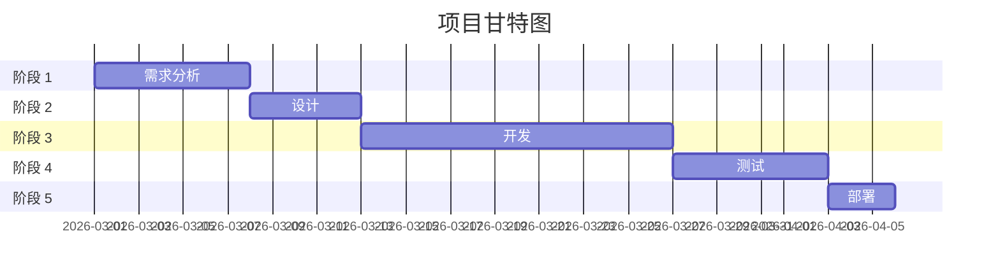

# 项目计划 - [项目名称]

> 版本：v1.0
> 日期：YYYY-MM-DD
> 作者：@项目经理

---

## 1. 项目概览

| 项目 | 内容 |
|-----|------|
| 项目名称 | |
| 项目负责人 | |
| 开始日期 | |
| 预计结束日期 | |
| 当前阶段 | 规划/执行/测试/部署 |

---

## 2. 项目范围

### 2.1 包含内容 (In Scope)
- [ ] 功能 1
- [ ] 功能 2

### 2.2 不包含内容 (Out of Scope)
- [ ] 功能 3（留待二期）

---

## 3. 里程碑规划

| 里程碑 | 日期 | 交付物 | 状态 |
|-------|------|-------|------|
| 需求评审完成 | | PRD 文档 | ⏳ |
| 架构设计完成 | | 架构文档 | ⏳ |
| 开发完成 | | 可运行系统 | ⏳ |
| 测试完成 | | 测试报告 | ⏳ |
| 上线发布 | | 生产环境 | ⏳ |

---

## 4. 任务分解 (WBS)

### 4.1 产品阶段
| ID | 任务 | 负责人 | 工期 | 依赖 | 状态 |
|---|------|-------|-----|------|------|
| 1.1 | 市场调研 | @市场调研 | 3d | - | ⏳ |
| 1.2 | PRD 编写 | @产品经理 | 5d | 1.1 | ⏳ |
| 1.3 | 原型设计 | @UI/UX | 4d | 1.2 | ⏳ |

### 4.2 技术阶段
| ID | 任务 | 负责人 | 工期 | 依赖 | 状态 |
|---|------|-------|-----|------|------|
| 2.1 | 架构设计 | @架构师 | 3d | 1.2 | ⏳ |
| 2.2 | 后端开发 | @后端 | 10d | 2.1 | ⏳ |
| 2.3 | 前端开发 | @前端 | 10d | 2.1 | ⏳ |
| 2.4 | 测试 | @测试 | 5d | 2.2,2.3 | ⏳ |
| 2.5 | 部署 | @DevOps | 2d | 2.4 | ⏳ |

---

## 5. 资源需求

| 角色 | 人数 | 投入比例 | 时间段 |
|-----|------|---------|-------|
| 产品经理 | 1 | 50% | 第 1-2 周 |
| 架构师 | 1 | 30% | 第 2-3 周 |
| 后端工程师 | 2 | 100% | 第 3-6 周 |
| 前端工程师 | 1 | 100% | 第 3-6 周 |
| 测试工程师 | 1 | 50% | 第 5-6 周 |

---

## 6. 风险管理

| 风险 | 概率 | 影响 | 缓解措施 | 状态 |
|-----|------|-----|---------|------|
| 需求变更频繁 | 中 | 高 | 建立变更控制流程 | 🟡 |
| 技术难点攻关 | 低 | 高 | 预留 buffer 时间 | 🟢 |
| 人员流动 | 低 | 中 | 文档化 + 代码审查 | 🟢 |

---

## 7. 沟通计划

| 会议 | 频率 | 参与人 | 时间 |
|-----|------|-------|------|
| 每日站会 | 每日 | 全体 | 10:00 |
| 周会 | 每周 | 全体 | 周一 14:00 |
| 迭代评审 | 每两周 | 全体 + 利益相关者 | 双周周五 |

---

## 8. 更新日志

| 版本 | 日期 | 变更内容 | 作者 |
|-----|------|---------|------|
| v1.0 | | 初始版本 | |

---

**Path: `.claude/doc/00_Project_Management/project_plan_[项目名]_v[版本].md`**
