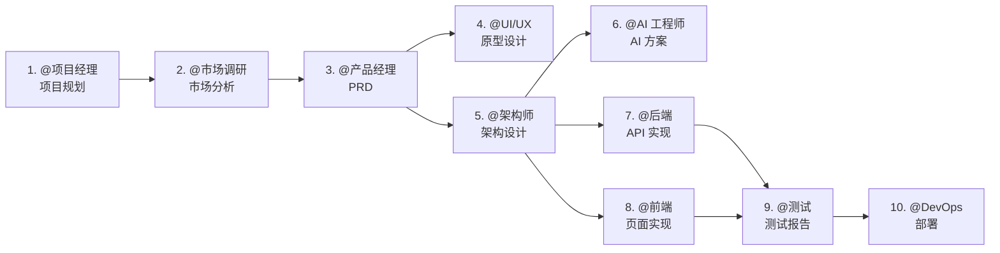

# Agent Team Framework

> 🚀 开箱即用的多 Agent 协作框架 —— 让 AI 团队为你的项目工作

一套完整的 Agent 角色系统，包含 10 个预定义角色，覆盖从产品规划到部署上线的完整开发流程。

---

## ⚠️ 首次使用必读

**在开始项目之前，请先完成以下初始化步骤：**

### 1. 确认项目名称

打开 `.claude/doc/PROJECT_INDEX.md`，将所有 `[项目名称]` 占位符替换为你的实际项目名称：

```markdown
# 你的项目名称 文档索引

> 最后更新：YYYY-MM-DD
> 维护者：@项目经理
```

同时更新 `CLAUDE.md` 中的示例文件名，将 `prd_myproject_v1.0.md` 等示例改为你自己的项目命名风格。

### 2. 检查角色配置

根据你的项目需求，确认是否需要所有 10 个角色：

| 角色 | 是否需要 | 说明 |
|------|---------|------|
| @项目经理 | ✅ 建议保留 | 负责进度跟踪和文档索引维护 |
| @市场调研 | ⚠️ 可选 | 内部工具/已验证需求可跳过 |
| @产品经理 | ✅ 建议保留 | 需求分析和 PRD 编写 |
| @UI/UX 设计师 | ✅ 建议保留 | 交互原型设计 |
| @架构师 | ✅ 建议保留 | 技术架构设计 |
| @AI 工程师 | ⚠️ 可选 | 有 AI 功能时启用 |
| @后端工程师 | ✅ 建议保留 | API 实现 |
| @前端工程师 | ✅ 建议保留 | 前端实现 |
| @测试工程师 | ✅ 建议保留 | 测试策略和报告 |
| @DevOps | ⚠️ 可选 | 简单项目可人工部署 |

### 3. 开始项目

召唤 @项目经理 开始项目规划：

```
@项目经理 请为这个项目创建项目计划和任务拆解
```

---

## 🎭 可用角色

| 角色 | 职责 | 产出物 |
|------|------|--------|
| @项目经理 | 项目规划、进度跟踪、风险管理 | 项目计划、周报、风险日志 |
| @市场调研 | 竞品分析、用户画像、市场趋势 | 市场调研报告 |
| @产品经理 | PRD 编写、需求分析、验收标准 | PRD 文档 |
| @UI/UX 设计师 | 交互原型、用户体验设计 | HTML 交互原型 |
| @架构师 | 技术选型、架构设计、API 规范 | 架构设计文档、API 合同 |
| @AI 工程师 | AI 技术方案、Prompt 设计、RAG 架构 | AI 技术方案 |
| @后端工程师 | API 实现、数据库设计、业务逻辑 | API 代码、数据库迁移 |
| @前端工程师 | 前端实现、组件开发、API 集成 | 前端代码 |
| @测试工程师 | 测试策略、用例编写、测试报告 | 测试报告 |
| @DevOps | CI/CD、容器化、监控配置 | 部署配置、运维文档 |

---

## 🔄 标准工作流



---

## 📁 目录结构

```
.claude/
├── agents/                 # Agent 角色定义（10 个角色）
│   ├── project_manager.md
│   ├── market_researcher.md
│   ├── product_manager.md
│   ├── ui_ux_designer.md
│   ├── architect.md
│   ├── ai_engineer.md
│   ├── backend_engineer.md
│   ├── frontend_engineer.md
│   ├── testing_engineer.md
│   └── devops_engineer.md
├── templates/              # 文档模板（7 个模板）
│   ├── market_research_template.md
│   ├── prd_template.md
│   ├── architecture_template.md
│   ├── api_contract_template.md
│   ├── test_report_template.md
│   ├── devops_template.md
│   └── project_plan_template.md
└── doc/                    # 项目文档（由 Agent 生成）
    ├── PROJECT_INDEX.md    # 文档索引
    ├── 00_Project_Management/
    ├── 01_Product_Design/
    ├── 02_Architecture/
    ├── 03_API_Contract/
    ├── 04_Test_Reports/
    └── 05_DevOps/
```

---

## 📝 文档模板

所有模板都在 `.claude/templates/` 目录下，包含：

| 模板 | 用途 |
|------|------|
| `market_research_template.md` | 市场调研报告 |
| `prd_template.md` | 产品需求文档 |
| `architecture_template.md` | 技术架构设计 |
| `api_contract_template.md` | API 接口规范 |
| `test_report_template.md` | 测试报告 |
| `devops_template.md` | 部署配置文档 |
| `project_plan_template.md` | 项目计划 |

---

## ⚙️ 配置说明

### 权限配置

编辑 `.claude/settings.local.json` 添加必要的权限：

```json
{
  "permissions": {
    "allow": [
      "Write",
      "Edit",
      "Glob",
      "Grep",
      "Bash(npm:*)",
      "Bash(git:*)",
      "Bash(docker:*)"
    ]
  }
}
```

### 角色裁剪

根据项目需求，可以删除不需要的角色：

**精简模式**（快速原型）：
- 保留：@项目经理、@产品经理、@架构师、@全栈工程师
- 删除：@市场调研、@AI 工程师、@DevOps

**AI 项目模式**：
- 重点配置：@AI 工程师、@后端工程师
- 可选：@DevOps（如需要自动化部署）

---

## 📌 最佳实践

### 1. 文档索引维护
每次生成新文档后，@项目经理 应更新 `PROJECT_INDEX.md`

### 2. 文件命名规范
```
[角色]_[项目]_[功能]_v[版本].md
示例：prd_myapp_login_v1.0.md
```

### 3. 角色交接
每个角色完成任务后，会提示下一步应该召唤哪个角色

### 4. 模板使用
优先使用模板，保持文档格式一致性

---

## 🛠️ 故障排除

### Q: 某个角色不工作？
A: 检查 `.claude/agents/[角色名].md` 是否存在，确保 CLAUDE.md 中有对应配置

### Q: 文档散落在各处？
A: 提醒 Agent 遵循存储规范，所有文档必须在 `.claude/doc/` 下

### Q: 如何新增角色？
A:
1. 在 `.claude/agents/` 创建新的 `.md` 文件
2. 在 `CLAUDE.md` 中添加角色映射
3. 更新 `PROJECT_INDEX.md`

---

## 📄 License

MIT License - 可自由用于任何项目

---

## 🙏 贡献

欢迎提交 Issue 和 PR 来改进这个框架！
