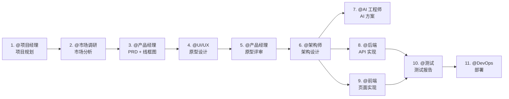

# Agent Team Framework

> 🚀 开箱即用的多 Agent 协作框架 —— 让 AI 团队为你的项目工作

一套完整的 Agent 角色系统，包含 10 个预定义角色，覆盖从产品规划到部署上线的完整开发流程。

**特点**：
- 🎭 **10 个专业角色** - 项目经理、产品经理、架构师、工程师等
- 📋 **质量卡点机制** - 7 道关卡确保阶段交付质量（QG-01/QG-02/QG-02.5/QG-03/QG-03.5/QG-04/QG-05）
- 🤖 **自动初始化** - 首次对话自动检测并配置项目

---

## ⚠️ 首次使用必读

**在开始项目之前，请确保项目已初始化：**

### 自动初始化

第一次使用时，Claude Code 会自动检测项目是否已初始化。如果未初始化，会提示你输入项目名称和描述，然后自动完成配置。

### 开始项目

初始化完成后，召唤 @项目经理 开始项目规划：

```
@项目经理 请为这个项目创建项目计划和任务拆解
```

> 💡 **说明**：所有 10 个角色默认可用，根据项目实际需求选择召唤对应角色即可。

---

## 🎭 可用角色

框架包含 10 个预定义角色，覆盖完整开发流程：

| 角色 | 职责 | 产出物 |
|------|------|--------|
| @项目经理 | 项目规划、进度跟踪、风险管理 | 项目计划、周报、风险日志 |
| @市场调研 | 竞品分析、用户画像、市场趋势 | 市场调研报告 |
| @产品经理 | PRD 编写 + **线框图**、需求分析、验收标准 | PRD 文档、页面线框图 |
| @UI/UX 设计师 | **基于线框图**进行高保真交互原型、用户体验设计 | HTML 交互原型 |
| @架构师 | 技术选型、架构设计、API 规范 | 架构设计文档、API 合同 |
| @AI 工程师 | AI 技术方案、Prompt 设计、RAG 架构 | AI 技术方案 |
| @后端工程师 | API 实现、数据库设计、业务逻辑 | API 代码、数据库迁移 |
| @前端工程师 | 前端实现、组件开发、API 集成 | 前端代码 |
| @测试工程师 | 测试策略、用例编写、测试报告 | 测试报告 |
| @DevOps | CI/CD、容器化、监控配置 | 部署配置、运维文档 |

> 💡 **使用说明**：所有角色默认可用，根据项目实际需求召唤对应角色即可。例如：内部工具项目可跳过 @市场调研，AI 项目重点使用 @AI 工程师。

---

## 🔄 标准工作流



---

## 📁 目录结构

```
.claude/
├── agents/                 # Agent 角色定义（10 个角色）
│   ├── project_manager.md
│   ├── market_researcher.md
│   ├── product_manager.md
│   ├── ui_ux_designer.md
│   ├── architect.md
│   ├── ai_engineer.md
│   ├── backend_engineer.md
│   ├── frontend_engineer.md
│   ├── testing_engineer.md
│   └── devops_engineer.md
├── templates/              # 文档模板（9 个模板）
│   ├── market_research_template.md
│   ├── prd_template.md
│   ├── architecture_template.md
│   ├── api_contract_template.md
│   ├── test_report_template.md
│   ├── devops_template.md
│   ├── project_plan_template.md
│   ├── config_template.md
│   └── quality_gate.md     # 质量卡点检查清单
├── doc/                    # 项目文档（由 Agent 生成）
│   ├── PROJECT_INDEX.md    # 文档索引（由各角色 Agent 更新）
│   ├── 00_Project_Management/
│   ├── 01_Product_Design/
│   ├── 02_Architecture/
│   ├── 03_API_Contract/
│   ├── 04_Test_Reports/
│   └── 05_DevOps/
```

---

## 📝 文档模板

所有模板都在 `.claude/templates/` 目录下，包含：

| 模板 | 用途 |
|------|------|
| `market_research_template.md` | 市场调研报告 |
| `prd_template.md` | 产品需求文档（带填写示例） |
| `architecture_template.md` | 技术架构设计（带 trade-off 指引） |
| `api_contract_template.md` | API 接口规范 |
| `test_report_template.md` | 测试报告 |
| `devops_template.md` | 部署配置文档 |
| `project_plan_template.md` | 项目计划 |
| `config_template.md` | 环境配置规范 |
| `quality_gate.md` | 质量卡点检查清单 |

---

## ⚙️ 配置说明

### 权限配置

编辑 `.claude/settings.local.json` 添加必要的权限：

```json
{
  "permissions": {
    "allow": [
      "Write",
      "Edit",
      "Glob",
      "Grep",
      "Bash(npm:*)",
      "Bash(git:*)",
      "Bash(docker:*)"
    ]
  }
}
```

### 角色裁剪

根据项目需求，可以删除不需要的角色：

**精简模式**（快速原型）：
- 保留：@项目经理、@产品经理、@架构师、@全栈工程师
- 删除：@市场调研、@AI 工程师、@DevOps

**AI 项目模式**：
- 重点配置：@AI 工程师、@后端工程师
- 可选：@DevOps（如需要自动化部署）

---

## 🔄 Agent Team 协作模式

### 与传统开发的区别

| 维度 | 传统开发团队 | Agent Team |
|------|-------------|------------|
| **工作时间** | 固定工时、需要休息 | 24/7 待命，随时响应 |
| **沟通同步** | 每天站会、周会、评审会 | 异步交接，文档即沟通 |
| **开发周期** | Sprint/Iteration（1-4 周） | 无固定周期，任务驱动 |
| **进度跟踪** | 燃尽图、看板、工时表 | 质量卡点、文档完成度 |
| **交接方式** | 会议、邮件、即时消息 | 文档索引 + 质量卡点确认 |

### 核心特点

**1. 异步协作**
- 每个角色完成任务后，更新 `PROJECT_INDEX.md` 并提示下一步
- 无需等待会议或同步沟通，用户根据提示召唤下一角色即可

**2. 质量卡点驱动**
- 不以时间为周期，而以**质量卡点**为里程碑
- 每个阶段完成后必须通过检查清单，才能进入下一阶段

**3. 文档即契约**
- PRD、架构文档、API 合同等是所有协作的"宪法"
- 所有决策、变更必须记录在文档中，而非口头沟通

**4. 用户即项目经理**
- 用户负责决策和审批（如 PRD 评审、原型确认）
- Agent 负责执行和建议，用户拥有最终决定权

---

## 📌 最佳实践

### 1. 文档索引维护
**每个角色负责更新**：完成任务后，各角色必须在对应目录生成文档，并更新 `PROJECT_INDEX.md`。

### 2. 质量卡点检查
每个阶段完成后，对照 `.claude/templates/quality_gate.md` 进行检查：
- **QG-01**: 项目规划 → 产品需求
- **QG-02**: 产品需求 → 架构设计
- **QG-02.5**: 产品需求 → 交互原型（线框图检查）
- **QG-03**: 架构设计 → 代码实现
- **QG-03.5**: 交互原型 → 架构设计/开发（**产品经理评审**）
- **QG-04**: 代码实现 → 测试
- **QG-05**: 测试 → 部署

### 3. 文件命名规范
```
[角色]_[项目]_[功能]_v[版本].md
示例：prd_myapp_login_v1.0.md
```

### 4. 角色交接
每个角色完成任务后，会提示下一步应该召唤哪个角色

### 5. 模板使用
优先使用模板，保持文档格式一致性。模板中包含填写说明和示例。

---

## 🛠️ 故障排除

### Q: 某个角色不工作？
A: 检查 `.claude/agents/[角色名].md` 是否存在，确保 CLAUDE.md 中有对应配置

### Q: 文档散落在各处？
A: 提醒 Agent 遵循存储规范，所有文档必须在 `.claude/doc/` 下

### Q: 如何新增角色？
A:
1. 在 `.claude/agents/` 创建新的 `.md` 文件
2. 在 `CLAUDE.md` 中添加角色映射
3. 更新 `PROJECT_INDEX.md`

### Q: 项目未初始化怎么办？
A:
第一次对话时，Claude Code 会自动检测并提示你输入项目名称和描述，然后自动完成初始化。

### Q: 质量卡点怎么使用？
A:
1. 打开 `.claude/templates/quality_gate.md`
2. 找到对应阶段的检查清单
3. 逐项检查通过后，再开始下一阶段工作

---

## 📄 License

MIT License - 可自由用于任何项目

---

## 🙏 贡献

欢迎提交 Issue 和 PR 来改进这个框架！
